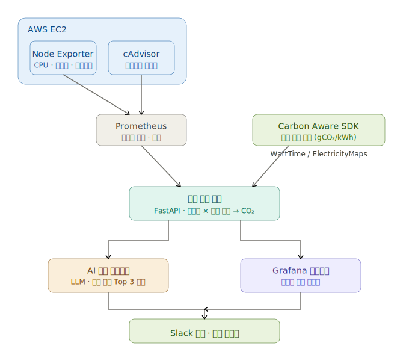

# 🌱 GreenOps Platform

> AI-powered cloud carbon monitoring and green scheduling platform

[](https://python.org)
[](https://fastapi.tiangolo.com)
[](https://prometheus.io)
[](https://grafana.com)
[](https://carbon-aware-sdk.greensoftware.foundation)

<br>

## 📌 배경

AI·클라우드 인프라의 폭발적 성장으로 데이터센터 탄소 배출이 급증하고 있습니다.
Google은 2019년 대비 탄소 배출이 **48% 증가**, EU CSRD·K-ESG 등 탄소 공시 규제도 강화되고 있습니다.

그러나 기존 클라우드 콘솔은 **CPU·비용만 보여줄 뿐, 탄소 배출량을 실시간으로 추적하거나 줄이는 기능이 없습니다.**

**GreenOps Platform**은 서버 메트릭과 전력망 탄소 강도 데이터를 결합해
실시간 탄소 배출을 모니터링하고, AI가 워크로드 실행 시점을 최적화해 탄소를 줄입니다.

<br>

## 🏗️ 아키텍처




<br>

## ✨ 주요 기능

| 기능 | 설명 |
|---|---|
| **실시간 탄소 모니터링** | Prometheus 메트릭 × 탄소 강도 → 서비스별 CO₂ 실시간 환산 |
| **탄소 대시보드** | Grafana — 서비스별·시간대별·리전별 탄소 시각화 |
| **AI 그린 스케줄링** | 탄소 강도 예측 기반으로 배치 워크로드 실행 최적 시점 Top 3 추천 |
| **멀티 리전 비교** | 서울·도쿄·버지니아 리전 탄소 강도 실시간 비교 |
| **Slack 알림** | 일일 탄소 요약 + 그린 스케줄링 추천 자동 전송 |

<br>

## 🛠️ 기술 스택

| 분류 | 기술 |
|---|---|
| 메트릭 수집 | Prometheus, Node Exporter, cAdvisor |
| 탄소 강도 데이터 | [Carbon Aware SDK](https://github.com/Green-Software-Foundation/carbon-aware-sdk) (Green Software Foundation) |
| 백엔드 | Python 3.11, FastAPI |
| AI 스케줄링 | OpenAI API (GPT-4o-mini) |
| 시각화 | Grafana 10.x |
| 알림 | Slack Webhook API |
| 인프라 | AWS EC2, Docker Compose, Terraform |

<br>

## 🚀 실행 방법

### 사전 요구사항

- Docker & Docker Compose
- WattTime 계정 ([무료 가입](https://www.watttime.org/sign-up/))
- OpenAI API 키
- Slack Webhook URL

### 1. 레포지토리 클론

```bash
git clone https://github.com/leah-1ee/greenops-platform.git
cd greenops-platform
```

### 2. 환경변수 설정

```bash
cp .env.example .env
```

`.env` 파일을 열고 아래 항목을 채워주세요.

```env
# Carbon Aware SDK
WATTTIME_USERNAME=your_username
WATTTIME_PASSWORD=your_password

# OpenAI
OPENAI_API_KEY=sk-...

# Slack
SLACK_WEBHOOK_URL=https://hooks.slack.com/services/...

# 대상 리전 (쉼표 구분)
TARGET_REGIONS=kr,jp-to,us-east
```

### 3. 실행

```bash
docker compose up -d
```

| 서비스 | URL |
|---|---|
| Grafana 대시보드 | http://localhost:3000 (admin / admin) |
| FastAPI Swagger | http://localhost:8000/docs |
| Carbon Aware SDK | http://localhost:8090/swagger |
| Prometheus | http://localhost:9090 |

<br>

## 📡 API 명세

### 탄소 현황 조회

```
GET /api/carbon/current
```

```json
{
  "timestamp": "2025-04-28T09:00:00Z",
  "services": [
    {
      "name": "api-server",
      "region": "kr",
      "carbon_intensity_gco2_kwh": 415.2,
      "power_kwh": 0.032,
      "carbon_gco2": 13.3
    }
  ]
}
```

### 그린 스케줄링 추천 조회

```
GET /api/scheduling/recommend?workload=ml-training&duration_hours=4
```

```json
{
  "recommendations": [
    {
      "rank": 1,
      "start_time": "2025-04-28T02:00:00Z",
      "carbon_intensity": 210.5,
      "estimated_saving_gco2": 42.3,
      "reason": "새벽 2시는 풍력 발전 비중이 높아 탄소 강도가 가장 낮습니다."
    }
  ]
}
```

<br>

## ⚙️ Carbon Aware SDK 설정

이 프로젝트는 [Green Software Foundation](https://greensoftware.foundation/)의 **Carbon Aware SDK**를 탄소 강도 데이터 소스로 사용합니다.

```yaml
# infra/carbon-aware-sdk/appsettings.json
{
  "DataSources": {
    "EmissionsDataSource": "WattTime",
    "ForecastDataSource": "WattTime"
  },
  "WattTimeClient": {
    "Username": "${WATTTIME_USERNAME}",
    "Password": "${WATTTIME_PASSWORD}"
  }
}
```

지원 리전 및 추가 데이터 소스(ElectricityMaps 등)는 [SDK 공식 문서](https://carbon-aware-sdk.greensoftware.foundation)를 참고해주세요.

<br>

## 📁 프로젝트 구조

```
greenops-platform/
├── README.md
├── docker-compose.yml
├── .env.example
├── infra/                    # 인프라 설정
│   ├── terraform/
│   ├── prometheus/
│   │   └── prometheus.yml
│   └── carbon-aware-sdk/
│       └── appsettings.json
├── backend/                  # 탄소 환산 엔진 (FastAPI)
│   ├── Dockerfile
│   ├── main.py
│   ├── routers/
│   │   ├── carbon.py
│   │   └── scheduling.py
│   └── services/
│       ├── carbon_engine.py  # 탄소 환산 핵심 로직
│       └── sdk_client.py     # Carbon Aware SDK 연동
├── scheduler/                # AI 그린 스케줄링 엔진
│   ├── Dockerfile
│   ├── forecast.py           # 탄소 강도 예측 데이터 처리
│   └── recommender.py        # LLM 추천 생성
├── grafana/
│   └── dashboards/
│       └── carbon.json       # Grafana 대시보드 프리셋
└── docs/
    ├── architecture.md
    └── mvp-requirements.md
```

<br>

## 👥 팀원

| 역할 | 담당 |
|---|---|
| 인프라 | AWS, Terraform, Prometheus, Carbon Aware SDK 배포 |
| 백엔드 | FastAPI, 탄소 환산 엔진, Slack 연동 |
| AI/데이터 | 그린 스케줄링 엔진, LLM 프롬프트, 예측 분석 |
| 프론트/시각화 | Grafana 대시보드, 발표 자료 |


<br>

---

> 이 프로젝트는 **EU CSRD**, **K-ESG** 등 탄소 공시 규제 강화에 대응하고,  
> 클라우드 인프라 운영의 탄소 발자국을 줄이기 위해 개발되었습니다.